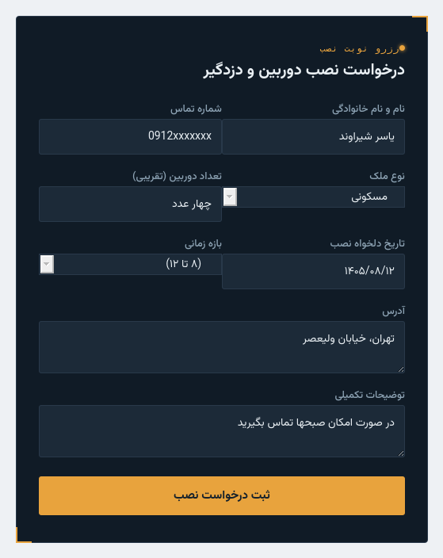
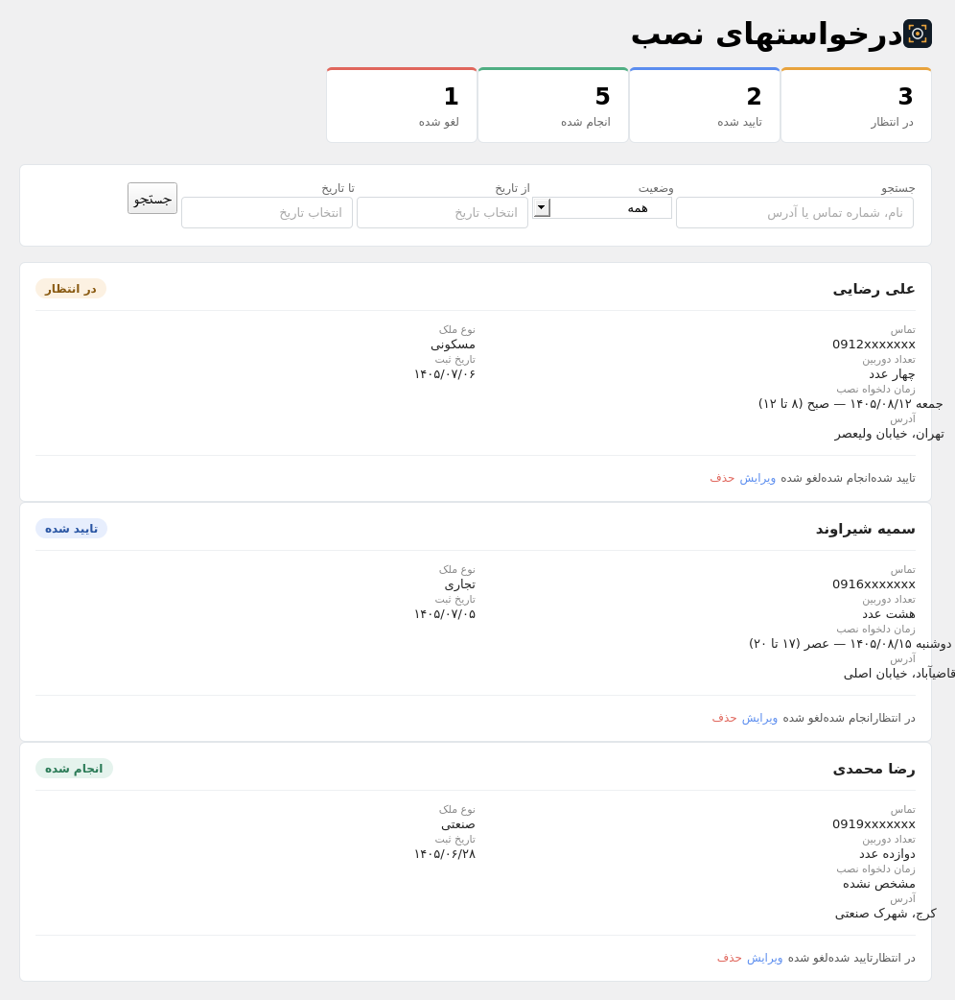

# مدیریت نوبت نصاب

افزونه‌ی وردپرس برای نصابان دوربین مداربسته و دزدگیر: مشتری از طریق فرم، نوبت نصب ثبت می‌کند و درخواست‌ها داخل پیشخوان وردپرس مدیریت می‌شوند.

*WordPress plugin for CCTV and alarm installers: customers book an installation through a form, and requests are managed in the WordPress dashboard.*

## امکانات
- فرم ثبت نوبت نصب برای مشتری
- مدیریت درخواست‌ها در پیشخوان
- اطلاع‌رسانی خودکار با ایمیل

## در حال توسعه
- جستجوی پیشرفته در لیست درخواست‌ها

## تصاویر

## نصب
1. پوشه‌ی افزونه را در `wp-content/plugins` کپی کنید.
2. از بخش افزونه‌ها، آن را فعال کنید.

## تکنولوژی
PHP، وردپرس

## نمونه‌ی اجرا
[security.yaserben.ir](https://security.yaserben.ir)
